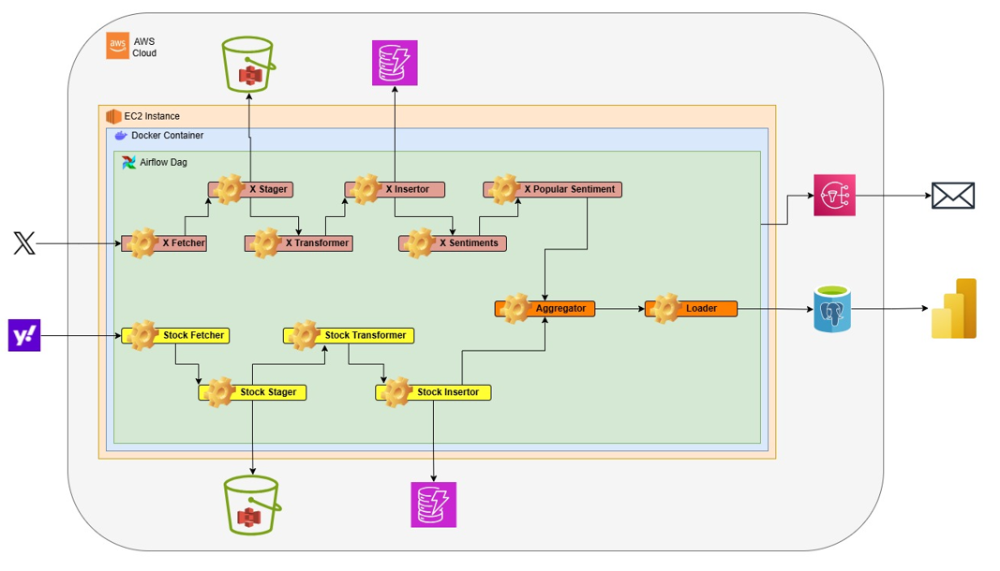
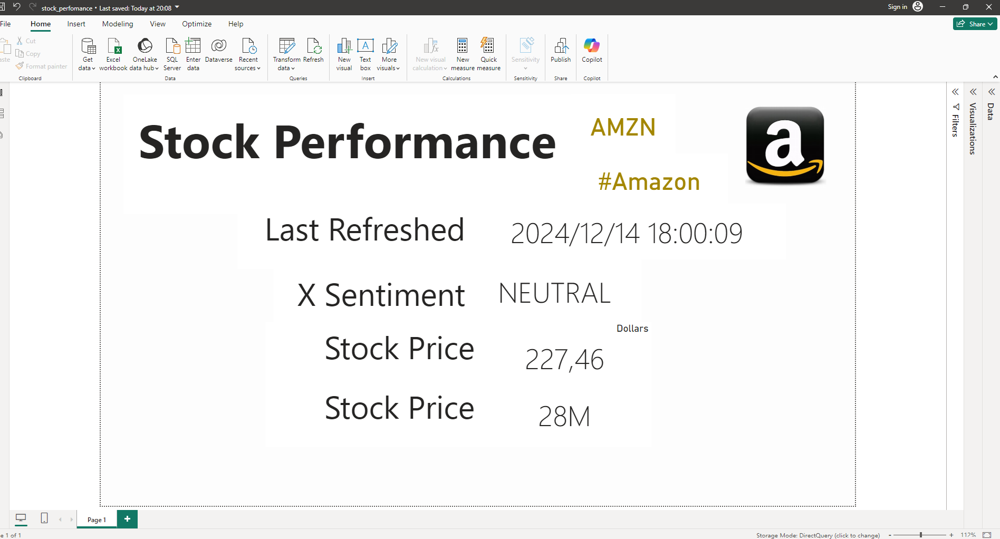
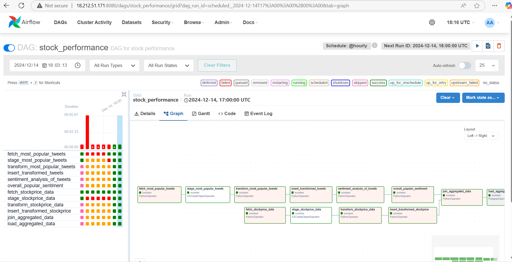
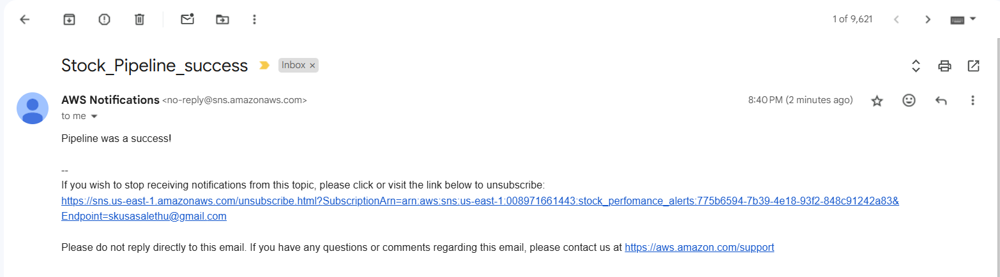

# The Stock Perfomance ETL Pipeline

This stock perfomance ETL pipeline automates the periodic extraction, transformation and central storage of popular sentiment about a company on X social media, with the changes in the the company's stock prices. This pipeline is implemented using Apache Airflow, containerized with Docker, and hosted on an AWS EC2 instance. The pipeline is designed to fetch data from various sources, process it, and store the results in different AWS services. The output data is pulled into PowerBI for dashboard reporting.

## Solution Architecture




## Pipeline Components

### 1. The Airflow Service
- **Containerized using Docker** and hosted on an **AWS EC2 instance**.
- The Airflow DAG is composed of 12 tasks and is scheduled to run **hourly**.

### 2. The Dag Tasks
#### 2.1. X-related Tasks
- **fetch_most_popular_tweets**: Sends a request to the [X API](https://developer.x.com/) to fetch the top 10 most popular public posts with the hashtag of the company of interest (i.e. #Amazon).
- **stage_most_popular_tweets**: Loads the response data into a JSON object and writes it to an AWS S3 bucket.
- **transform_most_popular_tweets**: Transforms the JSON object by removing characters that are not preferable.
- **insert_transformed_tweets**: Inserts the transformed data into an AWS DynamoDB database.
- **sentiment_analysis_of_tweets**: Submits the transformed data to AWS Comprehend for sentiment analysis (SA).
- **overall_popular_sentiment**: Summarized the sentiment data into an overall sentiment score.

#### 2.2. Stocks-related Tasks
- **fetch_stockprice_data**: Sends a request to the [yfinance API](https://pypi.org/project/yfinance/) to fetch stock price data for the company of interest (i.e. #Amazon).
- **stage_stockprice_data**: Loads the response into a JSON object and writes it to an AWS S3 bucket.
- **transform_stockprice_data**: Transforms schema of the JSON object.
- **insert_transformed_stockprice**: Inserts the transformed data into an AWS DynamoDB database.

#### 2.3. Combining Tasks
- **join_aggregated_data**: Joins the Stock sentiment and the stock metrtics data into a single dataset.

- **load_aggregated_data**: Loads the joined dataset into the AWS RDS PostgreSQL database.

#### 2.4. Notification Task
- When the Airflow DAG succeeds or fails, it sends a notification to the AWS SNS service. These alerts are sent via email to the subscribed recipients.

### 3. Power BI Dashboard
- Power BI reads the data from the AWS RDS PostgreSQL database for its dashboard.


## Quick Start
1. **Clone the repository**:
    ```bash
    git clone https://github.com/Kusasa/stock-perfomance-pipeline.git
    cd stock-perfomance-pipeline
    ```

2. **Update the Airflow dag**:
    - If needed, customize the [DAG file](/dag/stock_perfomance.py) - with its [helper module](/dag/stock_helper_functions.py) - in the `dags` directory.

3. **Update the AWS Cloudformation template**:
    - If needed, customize the [yaml template file](/infrastructure/pipeline_infra.yml) in the `infrastructure` directory.

4. **Configure AWS Commandline Interface credentials**:
    - From the AWS management console, create a user that will be used for deploying infrastructure and ensure that it has the permissions for the services in the architecture diagram, and ability to interact with aws cloud programmatically.
    - Get the user's aws access key id and secret access key.
    - From your computer's terminal, configure the aws cli credentials by running:
    ```bash
    aws configure
    ```

5. **Deploy the cloud infrastructure using AWS Cloudformation and airflow service**:  
    If you are using windows, run the [cmd deploy command](./deploy.cmd):
    ```bash
    deploy.cmd
    ```
    If you are using linux, run the [bash deploy command](./deploy.sh):
    ```bash
    deploy.sh
    ```
    - AWS Services deployed:
        - A VPC (with 3 subnets, routing, a security group, and an internet gateway)
        - 2 S3 Buckets
        - 2 Dynamodb databases
        - A RDS PostgreSQL database
        - A SNS Topic
    - Airflow Containers deployed:
        - A webserver (with anaconda and python libraries)
        - A scheduler
        - A metastore postgresql database
        - A worker

6. **Update the Airflow connections and variables**:  
    WAIT 3 MINUTES FOR THE AIRFLOW SERVICES TO FULLY START - Then access the Airflow web UI and declare the aws connections and dag environment variables (the default airflow webserver username and password is both **airflow**).
    - VARIABLES:
        - x_bearer_token (The X API Bearer token)
        - aws_access_key_id (The AWS Access Key)
        - aws_secret_access_key (The AWS Secret Key)
    - CONNECTIONS:
        - aws_default
        - aws_rds

7. **Running of the pipeline**:
    - Access the Airflow web UI and trigger the DAG manually or wait for the scheduled run.

8. **Connect PowerBI to pipeline output data and create the dashboard**:
    - Connect the AWS RDS Postgresql data source to PowerBI,
    - Create a stocks perfomance [dashboard](dashboard/stock_perfomance.pbix).
    

## Monitoring
- Monitor the pipeline execution through the Airflow web UI.

- Check AWS CloudWatch for logs and metrics related to the AWS services used.
- Check up on the email alerts sent by the airflow pipeline.


## Pipeline Termination
- To delete the entire data pipeline:  
    If you are using windows, run the [cmd terminate command](./terminate.cmd):  
    ```bash
    terminate.cmd
    ```  
    If you are using linux, run the [bash terminate command](./terminate.sh):  
    ```bash
    terminate.sh
    ```

## License
This project is licensed under the MIT License - see the LICENSE file for details.